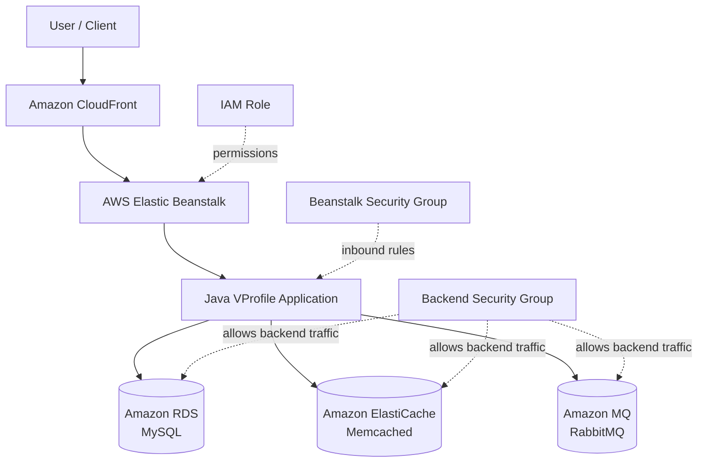
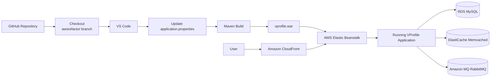

# VProfile – AWS Refactor & Elastic Beanstalk Deployment

> A Java-based VProfile application deployed on AWS using **AWS Elastic Beanstalk**, **Amazon RDS (MySQL)**, **Amazon ElastiCache (Memcached)**, and **Amazon MQ (RabbitMQ)**.

[](https://aws.amazon.com/)
[](https://www.oracle.com/java/)
[](https://maven.apache.org/)
[](https://aws.amazon.com/elasticbeanstalk/)
[](https://aws.amazon.com/cloudfront/)
[](https://www.rabbitmq.com/)
[](https://memcached.org/)

## 📌 Project Overview

This project demonstrates the deployment of the **VProfile** Java web application on AWS using a cloud-native application platform approach.

The application source code was obtained from the VProfile GitHub repository and the **`awsrefactor`** branch was used for this deployment.

The application was configured to use managed AWS services for its backend dependencies:

- **Amazon RDS – MySQL** for persistent relational data
- **Amazon ElastiCache – Memcached** for caching
- **Amazon MQ – RabbitMQ** for asynchronous messaging
- **AWS Elastic Beanstalk** for application deployment and environment management
- **Amazon CloudFront** for content delivery and edge caching in front of the application endpoint
- **AWS IAM** for controlled AWS permissions
- **Amazon EC2 / Beanstalk instances** as the underlying compute layer
- **Security Groups** for network-level access control
- **Amazon EC2 Key Pair** for instance access where required
- **Apache Maven** for building the deployable application artifact

---

## 🏗️ Architecture

### High-Level Architecture



### Deployment / Build Flow



---

## 🔄 How the Application Works

The overall flow is:

```text
User
  |
  v
Amazon CloudFront
  |
  v
AWS Elastic Beanstalk
  |
  v
VProfile Java Application
  |
  +----> Amazon RDS (MySQL)
  |          |
  |          +--> Persistent application data
  |
  +----> ElastiCache (Memcached)
  |          |
  |          +--> Cached application data
  |
  +----> Amazon MQ (RabbitMQ)
             |
             +--> Application messaging
```

### 1. User accesses the application

The user sends a request to the VProfile application running in the **Elastic Beanstalk environment**.

### 2. Elastic Beanstalk runs the application

Elastic Beanstalk manages the application environment and the underlying AWS compute resources required to run the Java application.

### 3. Application connects to RDS

The VProfile application connects to **Amazon RDS MySQL** using the database endpoint, username, and password configured in `application.properties`.

RDS provides persistent storage for the application's relational data.

### 4. Application connects to ElastiCache

The application uses **Amazon ElastiCache for Memcached** for caching.

The Memcached endpoint is configured in `application.properties`.

### 5. Application connects to Amazon MQ

The application uses **Amazon MQ with RabbitMQ** for messaging.

The RabbitMQ broker endpoint and credentials are configured in `application.properties`.

### 6. Security Groups control communication

Security Groups were configured so that the Elastic Beanstalk application environment could communicate with the required backend services.

The required inbound rules were added between the **Beanstalk Security Group** and the **backend Security Group**.

---

## ☁️ AWS Services Used

| AWS Service | Purpose |
|---|---|
| **Elastic Beanstalk** | Deploy and manage the VProfile Java application |
| **CloudFront** | Content delivery and edge caching in front of the application |
| **Amazon RDS** | MySQL relational database |
| **Amazon ElastiCache** | Memcached caching layer |
| **Amazon MQ** | RabbitMQ messaging broker |
| **IAM** | Permissions and role-based access |
| **EC2** | Underlying compute resources managed by Beanstalk |
| **Security Groups** | Control inbound and outbound network traffic |
| **EC2 Key Pair** | Secure instance access where required |

---

## 🛠️ Implementation Steps

### Step 1 – Create Security Groups

Security Groups were created for the application/backend communication.

The required inbound rules were configured so that the Elastic Beanstalk environment could communicate with the backend resources.

### Step 2 – Create EC2 Key Pair

An EC2 key pair was created for secure access to EC2-based resources where required.

### Step 3 – Configure Amazon RDS

An **Amazon RDS MySQL** database was created.

The database endpoint and credentials were later used by the VProfile application.

### Step 4 – Configure ElastiCache

An **Amazon ElastiCache Memcached** cluster was created.

The Memcached endpoint was used by the application as its caching service.

### Step 5 – Configure Amazon MQ

An **Amazon MQ RabbitMQ** broker was created.

RabbitMQ provides the messaging layer required by the VProfile application.

### Step 6 – Create IAM Role

An IAM role was created with the permissions required by the Elastic Beanstalk environment.

This allows AWS resources used by the application platform to access permitted AWS services without hard-coding AWS credentials into the application.

### Step 7 – Create Elastic Beanstalk Environment

An AWS Elastic Beanstalk application and environment were created for deploying the VProfile Java application.

### Step 8 – Clone the VProfile Repository

The original VProfile repository was cloned from GitHub:

**Repository:** https://github.com/hkhcoder/vprofile-project.git

The **`awsrefactor`** branch was used for this deployment.

```bash
git clone https://github.com/hkhcoder/vprofile-project.git
cd vprofile-project
git checkout awsrefactor
```

### Step 9 – Configure Application Properties

The repository was opened in VS Code.

The application's `application.properties` file was updated with the connection information for:

- Amazon RDS MySQL
- Amazon MQ RabbitMQ
- Amazon ElastiCache Memcached

Example configuration concept:

```properties
# Database
db.endpoint=<RDS-ENDPOINT>
db.username=<DB-USERNAME>
db.password=<DB-PASSWORD>

# RabbitMQ
rabbitmq.endpoint=<RABBITMQ-ENDPOINT>
rabbitmq.username=<RABBITMQ-USERNAME>
rabbitmq.password=<RABBITMQ-PASSWORD>

# Memcached
memcached.endpoint=<MEMCACHED-ENDPOINT>
```

> **Security note:** Never commit real database, RabbitMQ, or other production credentials to a public GitHub repository. Use environment variables, AWS Secrets Manager, or another secure secret-management mechanism for real deployments.

### Step 10 – Build the Application

Apache Maven was used to build the application and generate the deployable WAR artifact.

```bash
mvn clean install
```

The resulting WAR artifact was then prepared for deployment.

### Step 11 – Deploy to Elastic Beanstalk

The generated VProfile WAR artifact was uploaded to the Elastic Beanstalk environment and deployed.

```text
GitHub
   ↓
awsrefactor branch
   ↓
VS Code
   ↓
application.properties
   ↓
Maven
   ↓
WAR Artifact
   ↓
Elastic Beanstalk
   ↓
VProfile Application
```

### Step 12 – Configure Amazon CloudFront

An **Amazon CloudFront distribution** was configured in front of the application endpoint.

CloudFront acts as the application's content-delivery layer and provides an edge endpoint for users. Requests are forwarded from CloudFront to the configured application origin.

```text
User
  |
  v
CloudFront Edge Location
  |
  v
Application Origin
  |
  v
Elastic Beanstalk
  |
  v
VProfile Application
```

This adds a CDN layer between the user and the application and can improve content delivery by serving cacheable content from CloudFront edge locations.

### Step 13 – Configure Security Group Connectivity

Before deployment/testing, the required inbound rules were added to the relevant Security Groups.

This allowed the Beanstalk application environment to communicate with the backend services.

### Step 14 – Verify Deployment

After deployment, the Elastic Beanstalk environment was verified and the VProfile application was accessed to confirm that the application could communicate with:

- MySQL
- Memcached
- RabbitMQ

---

## 🔐 Security Design

The project uses AWS Security Groups to control network access.

```text
                    ┌─────────────────────────┐
                    │ Elastic Beanstalk       │
                    │ Security Group          │
                    └────────────┬────────────┘
                                 │
                    Allowed application traffic
                                 │
                                 ▼
                    ┌─────────────────────────┐
                    │ Backend Security Group  │
                    └──────┬──────┬──────┬────┘
                           │      │      │
                           ▼      ▼      ▼
                         RDS   Memcached RabbitMQ
```

### Security principles demonstrated

- Network access is controlled using Security Groups.
- Application traffic is allowed only through required rules.
- IAM roles are used instead of embedding AWS credentials into application code.
- Database and messaging credentials should be stored securely.
- Sensitive configuration should not be committed to public repositories.

---

## 📂 Project Structure

The repository is based on the VProfile project:

```text
vprofile-project/
├── src/
├── pom.xml
├── application.properties
├── README.md
└── ...
```

The important deployment-related files/components include:

| Component | Purpose |
|---|---|
| `pom.xml` | Maven project/build configuration |
| `src/` | Application source code |
| `application.properties` | Application configuration |
| `vprofile.war` | Deployable Java web artifact |

---

## 🔧 Technologies Used

### Application

- Java
- Spring-based VProfile application
- Apache Tomcat
- Maven

### AWS

- AWS Elastic Beanstalk
- Amazon CloudFront
- Amazon RDS
- Amazon ElastiCache
- Amazon MQ
- Amazon EC2
- IAM
- Security Groups
- EC2 Key Pair

### Backend

- MySQL
- Memcached
- RabbitMQ

### Development Tools

- Git
- GitHub
- Visual Studio Code
- Apache Maven

---

## 🎯 What This Project Demonstrates

This project demonstrates practical experience with:

- AWS application deployment
- CloudFront-based content delivery
- Elastic Beanstalk
- AWS managed database services
- Database connectivity
- Caching architecture
- Message broker integration
- IAM roles
- Security Groups
- Git/GitHub branch management
- Maven-based Java builds
- WAR artifact generation
- Application configuration
- AWS backend service integration
- Troubleshooting application-to-service connectivity

---

## 🚀 Future Improvements

Possible improvements for a production-style implementation:

- Add CI/CD using GitHub Actions
- Automate infrastructure using Terraform
- Store secrets in AWS Secrets Manager
- Add CloudWatch monitoring and alarms
- Implement automated testing
- Add blue/green deployment
- Add automated Elastic Beanstalk deployments
- Containerize the application
- Evaluate ECS/EKS for container-based deployment

---

## 🔗 Source Repository

Original VProfile project:

https://github.com/hkhcoder/vprofile-project.git

**Branch used:** `awsrefactor`

---

## 👨‍💻 Project Summary

**VProfile – AWS Refactor & Elastic Beanstalk Deployment**

A Java-based web application deployed on AWS using Elastic Beanstalk and integrated with managed AWS backend services including RDS MySQL, ElastiCache Memcached, and Amazon MQ RabbitMQ. The project covers application configuration, Maven artifact creation, IAM role configuration, Security Group connectivity, Git/GitHub workflow, and Elastic Beanstalk deployment.

> **Note:** This repository documents the AWS deployment and learning implementation. Do not publish passwords, private keys, database credentials, RabbitMQ credentials, or other secrets in the repository.
