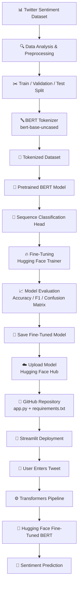
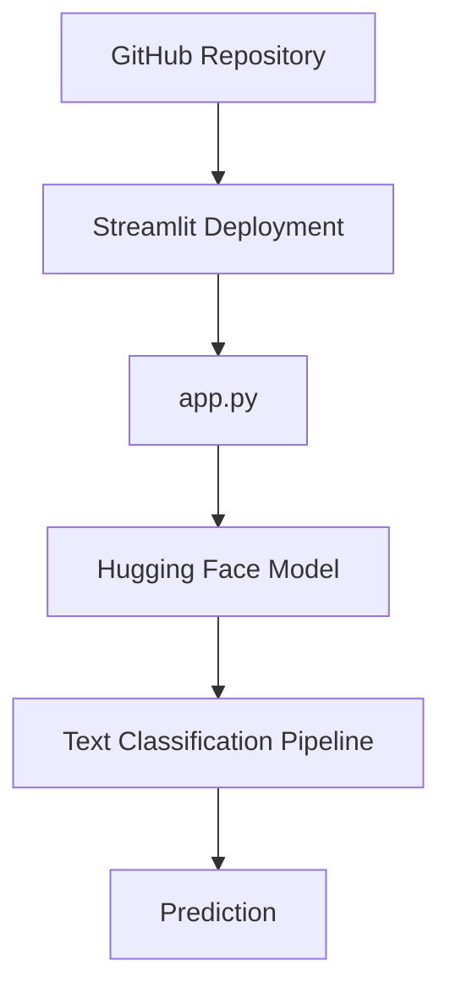
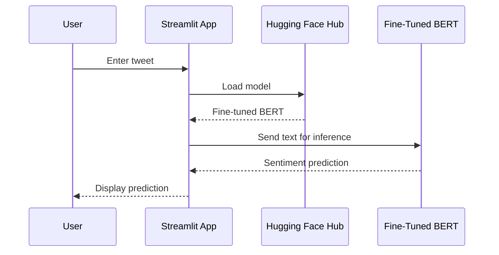

# Fine-Tuned BERT for Twitter Multi-Class Sentiment Classification

A complete NLP project that fine-tunes **BERT (`bert-base-uncased`)** for multi-class sentiment classification on Twitter/X-style text and deploys the trained model as an interactive **Streamlit** web application.

The project follows an end-to-end machine learning workflow:

**Dataset → Exploratory Data Analysis → Tokenization → Train/Validation/Test Split → BERT Fine-Tuning → Evaluation → Model Saving → Hugging Face Hub → Streamlit Deployment**

---

## 🚀 Project Overview

This project demonstrates how to take a pretrained BERT language model and adapt it for a custom Twitter sentiment classification task.

The trained model is published on the Hugging Face Hub as:

**`Shubham0786/bert-base-uncased-sentiment-model`**

The Streamlit application loads this model directly through the Hugging Face Transformers `pipeline` and predicts the sentiment class of user-provided text.

---

## 🏗️ Project Architecture

The complete project flow is:



### 🔄 How the Flow Works

**1. Dataset → Preprocessing**  
Twitter text is analyzed and prepared for model training.

**2. Preprocessing → Tokenization**  
The text is converted into BERT-compatible tokens using the `bert-base-uncased` tokenizer.

**3. Tokenization → BERT Fine-Tuning**  
The pretrained BERT model is fine-tuned for the project's multi-class sentiment classification task.

**4. Fine-Tuning → Evaluation**  
The trained model is evaluated using classification metrics and a confusion matrix.

**5. Evaluation → Hugging Face**  
After training, the fine-tuned model is saved and published to the Hugging Face Hub.

**6. Hugging Face → Streamlit**  
`app.py` loads the Hugging Face model through the Transformers `pipeline`.

**7. User → Prediction**  
The user enters a tweet in the Streamlit interface. The pipeline sends the text to the fine-tuned BERT model and returns the predicted sentiment.

### 🚀 Final Deployment Flow


### Deployment Flow



---

## 🧠 Model & Training Pipeline

### 1. Dataset

The notebook loads a Twitter multi-class sentiment dataset containing:

- `text` — tweet/text content
- `label` — numerical class identifier
- `label_name` — sentiment class name

The notebook performs basic dataset inspection including:

- Dataset shape
- Data types
- Missing-value analysis
- Descriptive statistics
- Class distribution
- Tweet word-count analysis

---

### 2. Exploratory Data Analysis

The project analyzes the distribution of sentiment classes and the number of words per tweet.

This helps understand:

- Class frequency
- Dataset balance
- Text-length distribution
- Differences in tweet length across sentiment classes

---

### 3. Train / Test / Validation Split

The dataset is divided using a stratified split so that the class distribution is preserved.

The notebook creates:

- **Training dataset**
- **Testing dataset**
- **Validation dataset**

These datasets are converted into Hugging Face `Dataset` / `DatasetDict` objects for integration with the Transformers training workflow.

---

### 4. BERT Tokenization

The pretrained tokenizer:

```text
bert-base-uncased
```

is loaded using Hugging Face Transformers.

Tweets are tokenized using:

- Padding
- Truncation

This converts raw text into the numerical representation required by BERT.

---

### 5. Model Architecture

The project starts with:

```text
BERT Base Uncased
```

and adds a sequence-classification head.

The number of output classes is determined dynamically from the dataset labels.

The notebook also creates:

```python
label2id
id2label
```

mappings so the model can associate numerical predictions with the original sentiment labels.

---

### 6. Fine-Tuning Configuration

The notebook uses Hugging Face `TrainingArguments` with the following configuration:

| Parameter | Value |
|---|---:|
| Learning Rate | `2e-5` |
| Epochs | `2` |
| Train Batch Size | `64` |
| Evaluation Batch Size | `64` |
| Weight Decay | `0.01` |
| Evaluation Strategy | `epoch` |

Training is performed using the Hugging Face `Trainer`.

---

### 7. Evaluation

The trained model is evaluated on the test dataset.

The notebook calculates:

- Accuracy
- Weighted F1 Score
- Classification Report
- Confusion Matrix

The confusion matrix is also visualized to understand the model's class-level predictions.

> Note: This README intentionally does not hard-code an accuracy/F1 score because the supplied notebook source does not contain a final numeric evaluation result.

---

## 💾 Model Saving

After fine-tuning, the model is saved locally using:

```python
trainer.save_model("bert-base-uncased-sentiment-model")
```

The saved model is then loaded with the Transformers text-classification pipeline.

---

## 🤗 Hugging Face Model

The deployed model is:

**Shubham0786/bert-base-uncased-sentiment-model**

Model page:

https://huggingface.co/Shubham0786/bert-base-uncased-sentiment-model

The Streamlit application uses this model directly:

```python
model = "Shubham0786/bert-base-uncased-sentiment-model"

classifier = pipeline(
    "text-classification",
    model=model
)
```

This allows the application to perform inference without storing the complete trained model inside the Streamlit repository.

---

## 🖥️ Streamlit Application

The Streamlit application provides a simple interface where the user can enter a tweet/text and click **Predict**.

The inference flow is:

```text
User Input
    ↓
Streamlit Text Area
    ↓
Transformers Pipeline
    ↓
Fine-Tuned BERT Model
    ↓
Sentiment Prediction
```

The application code uses:

```python
text = st.text_area("Enter your tweet here", "Type Here")

if st.button("Predict"):
    result = classifier(text)
    st.write(result)
```

---

## 📁 Project Structure

A recommended repository structure is:

```text
.
├── app.py
├── requirements.txt
├── README.md
└── apply_bert_on_twitter_dataset.ipynb
```

### Files

| File | Purpose |
|---|---|
| `app.py` | Streamlit inference application |
| `requirements.txt` | Python dependencies required by the application |
| `apply_bert_on_twitter_dataset.ipynb` | Complete model development and fine-tuning notebook |
| `README.md` | Project documentation |

---

## ⚙️ Requirements

The supplied `requirements.txt` contains:

```text
transformers
torch
huggingface_hub
```

For the Streamlit application, Streamlit also needs to be available in the deployment environment because `app.py` imports it.

---

## 🛠️ Run Locally

### 1. Clone the repository

```bash
git clone <YOUR_GITHUB_REPOSITORY_URL>
cd <YOUR_PROJECT_DIRECTORY>
```

### 2. Create a virtual environment

```bash
python -m venv venv
```

Activate it:

**Windows**

```bash
venv\Scripts\activate
```

**macOS / Linux**

```bash
source venv/bin/activate
```

### 3. Install dependencies

```bash
pip install -r requirements.txt
```

If Streamlit is not already included in the environment:

```bash
pip install streamlit
```

### 4. Run the application

```bash
streamlit run app.py
```

The application will open in your browser.

---

## ☁️ Deployment Workflow

The final deployment architecture is:



### Deployment Steps

1. Fine-tune BERT in the Jupyter notebook.
2. Save the trained model.
3. Upload/publish the fine-tuned model to Hugging Face.
4. Reference the Hugging Face model from `app.py`.
5. Push the Streamlit application files to GitHub.
6. Connect the GitHub repository to Streamlit deployment.
7. Streamlit installs the required dependencies and runs `app.py`.
8. The application loads the Hugging Face model and performs real-time inference.

---

## 🔄 End-to-End MLOps-Style Workflow

```text
                 MODEL DEVELOPMENT
                        │
                        ▼
             Twitter Sentiment Dataset
                        │
                        ▼
              Exploratory Data Analysis
                        │
                        ▼
                 Data Splitting
                        │
                        ▼
                   Tokenization
                        │
                        ▼
              BERT Fine-Tuning
                        │
                        ▼
                 Model Evaluation
                        │
                        ▼
                  Model Saving
                        │
                        ▼
              Hugging Face Hub
                        │
                        ▼
                 GitHub Repository
                        │
                        ▼
               Streamlit Deployment
                        │
                        ▼
                 Production Demo
```
---
## Screenshot


---

## 🔑 Technologies Used

- **Python**
- **PyTorch**
- **Hugging Face Transformers**
- **Hugging Face Datasets**
- **BERT**
- **Scikit-learn**
- **Pandas**
- **NumPy**
- **Matplotlib**
- **Seaborn**
- **Streamlit**
- **Hugging Face Hub**
- **GitHub**

---

## 📌 Key Learning Outcomes

This project demonstrates practical experience with:

- Transfer learning using BERT
- NLP text preprocessing
- Transformer tokenization
- Multi-class text classification
- Hugging Face `Dataset` and `DatasetDict`
- Fine-tuning pretrained Transformer models
- Hugging Face `Trainer`
- Accuracy and weighted F1 evaluation
- Confusion matrix analysis
- Saving and loading Transformer models
- Publishing a model to Hugging Face Hub
- Building a Streamlit inference application
- Deploying an ML application from GitHub


---

## ⭐ Project Pipeline at a Glance

```text
Fine-Tune BERT
      ↓
Evaluate Model
      ↓
Save Model
      ↓
Hugging Face Hub
      ↓
Connect Model with app.py
      ↓
GitHub
      ↓
Streamlit
      ↓
Live Sentiment Prediction
```

---

## 📄 Source Files

- Model development: `apply_bert_on_twitter_dataset.ipynb`
- Application: `app.py`
- Dependencies: `requirements.txt`
- Documentation: `README.md`
